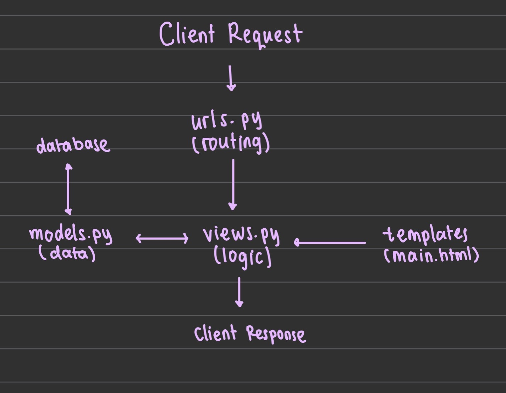
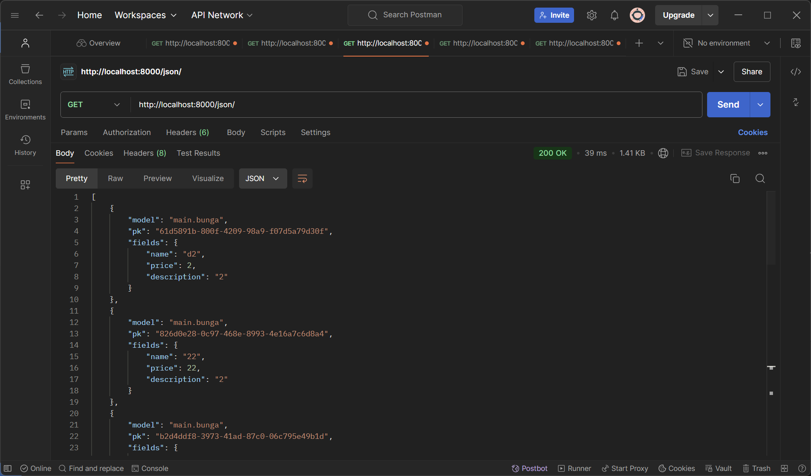
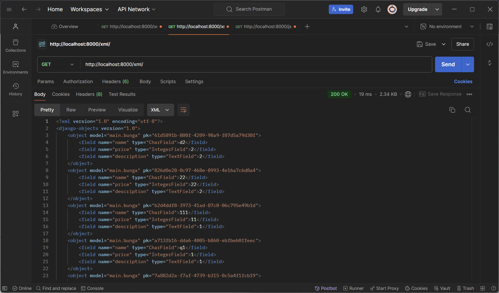
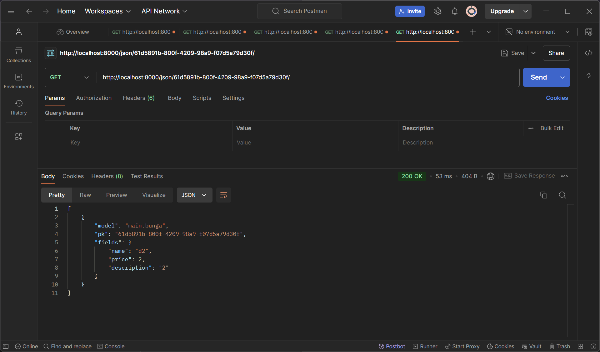
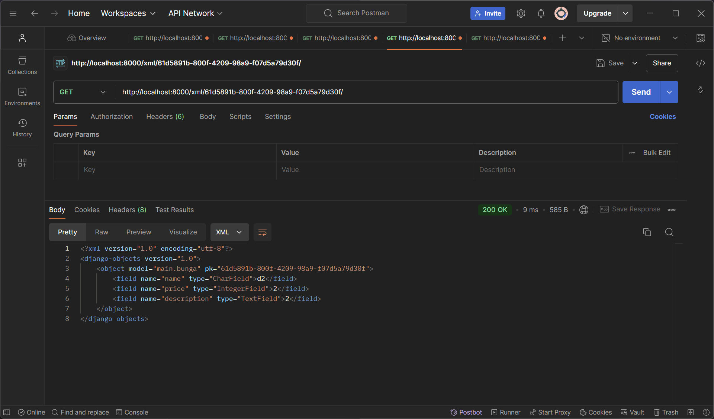

Nama : Nabila Maharani Putri
NPM  : 2306275191
Tugas: Tugas Individu 1 PBP 2024

Tugas 2
1. Jelaskan bagaimana cara kamu mengimplementasikan checklist di atas secara step-by-step (bukan hanya sekadar mengikuti tutorial)! 
 Saya mengimplementasikan satu persatu checklist dengan mengerjakan kembali apa yang dikerjakan di tutorial 0 dan tutorial 1. Pada pengerjaannya saya sambil memahami untuk apa step step tersebut dilakukan. Selain itu, saya menyesuaikan penamaan project, penamaan app, dan juga atribut yang digunakan. Berikut step by stepnya:
 > Membuat sebuah proyek Django baru: 
 Langkah ini saya mulai dengan membuat direktori baru dengan nama floemin (nama e-commerce saya) dan mengaktifkan virtual environment pada direktori ini. 
 > Membuat aplikasi dengan nama main pada proyek tersebut: 
 Saya membuat app baru bernama main dan mendaftaarkannya ke dalam list INSTALLED_APPS di setting.py.
 > Melakukan routing pada proyek agar dapat menjalankan aplikasi main: 
 Saya configure routingnya dengan membuat file urls.py di direktori app main dan menambahkan rute tersebut di urls.py project.
 > Membuat model pada aplikasi main dengan nama Product dan memiliki atribut wajib(name, price, description): 
 Saya menambahkan atribut atribut tersebut sesuai dengan tipe datanya. setelah itu, saya lakukan makemigration dan migrate.
 > Membuat sebuah fungsi pada views.py untuk dikembalikan ke dalam sebuah template HTML yang menampilkan nama aplikasi serta nama dan kelas kamu:
 Saya menambahkan nama app, nama saya, dan kelas ke dalam dict yang ada di views.py
 > Membuat sebuah routing pada urls.py aplikasi main untuk memetakan fungsi yang telah dibuat pada views.py:
 Saya memanggil function show_main yang ada di views.py
 > Melakukan deployment ke PWS terhadap aplikasi yang sudah dibuat sehingga nantinya dapat diakses oleh teman-temanmu melalui Internet: 
 Saya mendeploy ke PWS dengan bantuan dockerfile yang diberikan oleh asdos saya. 

2. Buatlah bagan yang berisi request client ke web aplikasi berbasis Django beserta responnya dan jelaskan pada bagan tersebut kaitan antara urls.py, views.py, models.py, dan berkas html.

 Setelah request masuk, URL nya akan dicocokkan dengan pola yang ada di urls.py. Jika cocok, akan dicek izinnya, apakah boleh diakses atau tidak. Jika boleh, akan dipanggil function yg sesuai di views.py. Jika tampilan tersebut membutuhkan data dari database, views.py akan berinteraksi dengan models.py. Setelah data diproses, views.py akan merender template HTML untuk ditampilkan ke client

3. Jelaskan fungsi git dalam pengembangan perangkat lunak!

 Git berfungsi sebagai sistem kontrol versi dari kode yang kita buat. Hal tersebut memungkinkan kita untuk melihat perubahan kode dari versi ke versi, bekerja dengan programmer lain pada satu waktu tanpa conflict, dan memudahkan mengembalikan kode ke versi sebelumnya jika terjadi kesalahan.

4. Menurut Anda, dari semua framework yang ada, mengapa framework Django dijadikan permulaan pembelajaran pengembangan perangkat lunak?

 Django dipilih karena mudah dipahami untuk pemula, punya struktur MVT yang membuat pengembangan lebih ter-organize.

5. Mengapa model pada Django disebut sebagai ORM?

 Model pada django disebut Object Relational Mapping (ORM) karena memungkinkan kita untuk berinteraksi dengan database menggunakan object python. Pada models.py, didefinisikan struktur data dan relasi antar data yang kemudian diterjemahkan menjadi tabel di database

Tugas 3
1. Jelaskan mengapa kita memerlukan data delivery dalam pengimplementasian sebuah platform?
 Kita memerlukan data delivery dalam pengimplementasian sebuah platform karena memungkinkan platform untuk menyingkronkan data dari berbagai sumber sehingga pengguna selalu mendapatkan data terbaru. Selain itu, penggunaan data delivery dapat memastikan platform tidak melambat atau kurang resposif karena kesulitan mengelola dan menyajikan data secara efisien.
2. Menurutmu, mana yang lebih baik antara XML dan JSON? Mengapa JSON lebih populer dibandingkan XML?
 JSON lebih baik dan populer karena lebih ringkas dan readable. Sintaks JSON cenderung lebih kecil ukuran datanya karena formatnya lebih sederhana. Selain itu, parsing pada JSON juga lebih mudah. JSON lebih populer karena banyak API web dan web service saat ini menggunakan JSON sebagai format standar.
3. Jelaskan fungsi dari method is_valid() pada form Django dan mengapa kita membutuhkan method tersebut?
 Method is_valid() berfungsi untuk memeriksa apakah data yang di-input memenuhi semua aturan validasi yang telah ditentukan di form. Jika semua data valid, method akan mereturn True dan jika sebaliknya akan mereturn False. Selain menangani validasi, method ini juga akan menampilkan pesan untuk user apabila ada data yang tidak sesuai aturan validasi. Kita membutuhkan method ini untuk memastikan hanya data yang lulus tes validasi yang bisa masuk ke database atau program.
4. Mengapa kita membutuhkan csrf_token saat membuat form di Django? Apa yang dapat terjadi jika kita tidak menambahkan csrf_token pada form Django? Bagaimana hal tersebut dapat dimanfaatkan oleh penyerang?
 Cross-Site Request Forgery (CSRF) adalah serangan yang manfaatkan kredensial user aktif untuk mengirim request tidak sah ke server. Kita membutuhkan csrf_token untuk mencegah CSRF. Jika kita tidak menggunakan csrf_token, penyerang dapat membuat page web palsu yang berisi formulir yang tujuannya untuk mengumpulkan data user secara tidak sah. Hal ini disebabkan penyerang yang memanfaatkan sesi user aktif dengan mengirim request palsu yang membahayakan keamanan platform.
5. Jelaskan bagaimana cara kamu mengimplementasikan checklist di atas secara step-by-step (bukan hanya sekadar mengikuti tutorial).
 -membuat model Bunga
 -membuat form BungaEntryForm
 -membuat view yang menampilkan form, memroses dan menyimpan data yang di-input user ke database menggunakan save()
 -menambah 4 function views baru yaitu show_json, show_xml, show_json_by_id, dan show_xml_by_id
 -membuat routing tiap view yang sesuai pada urls.py pada direktori project
 -memasukkan url tiap view di Postman untuk melihat apakah penampilan data sudah sesuai.

Tugas 4
1. Apa perbedaan antara HttpResponseRedirect() dan redirect()
 HttpResponseRedirect() adalah class yang mereturn HTTP 302, yaitu "redirect" menuju URL lain. URL perlu secara eksplisit disebutkan sebagai argumen
 redirect() lebih fleksibel dalam menerima parameter, dapat berypa view name, nama URL, dan juga model instance
2. Jelaskan cara kerja penghubungan model Product dengan User!
 Ketika produk dibuat, django akan menyimpan relasi antar objek produk dan User pembuat objek tersebut. User yang login menggunakan relasi ForegnKey yang menunjukkan bahwa setiap produk dimiliki oleh satu pengguna saja.
3. Apa perbedaan antara authentication dan authorization, apakah yang dilakukan saat pengguna login? Jelaskan bagaimana Django mengimplementasikan kedua konsep tersebut.
 Authentication adalah proses memverifikasi identitas pengguna yang dimasukkan di form. Authorization adalah proses menentukan hak akses bagi pengguna yang telah terautentikasi. Jadi, Django akan memverifikasi kredensial yang diinput pengguna. Jika valid, pengguna akan diarahkan ke halaman yang sesuai dengan hak aksesnya.
4. Bagaimana Django mengingat pengguna yang telah login? Jelaskan kegunaan lain dari cookies dan apakah semua cookies aman digunakan?
 Django menggunakan session dan cookie untuk mengingat pengguna yang telah login. Session merupakan mekanisme server-side yang menyimpan data sementara tentang pengguna. Saat berhasil login, Django akan membuat session baru dan memberikan Session ID yang unik. Session ID ini akan disimpan di server dan juga dikirimkan ke browser pengguna dalam bentuk cookie. Cookie adalah data kecil yang dikirimkan oleh server ke browser pengguna dan disimpan di komputer pengguna. Cookie yang berisi session ID ini akan digunakan oleh browser untuk mengirimkan kembali session ID ke server pada setiap permintaan berikutnya sehingga server dapat mengetahui pengguna yang sama sedang melakukan request dan dapat mengambil data session pengguna tersebut.
5. Jelaskan bagaimana cara kamu mengimplementasikan checklist di atas secara step-by-step (bukan hanya sekadar mengikuti tutorial).
 Pertama-tama, saya membuat function registrasi, login, dan logout. Berikutnya, saya membuat akun pengguna dan menambahkan data pada web e commerce saya. Setelahnya, saya logout dan baru menambahkan penerapan cookies dan session. Setelah itu, saya menghubungkan antara produk yang dibuat dan user yang membuat produk tersebut agar ketika seorang user login, user tersebut hanya bisa melihat produk produk yang berhasil dibuatnyha. Terakhir, saya menampilkan info waktu login terakhir.